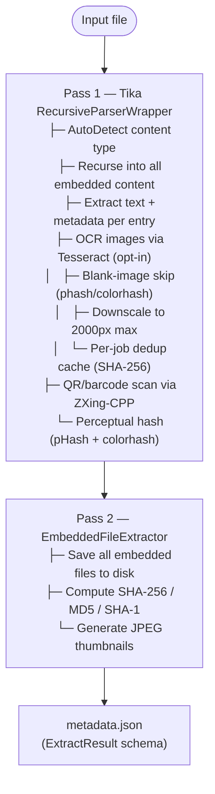
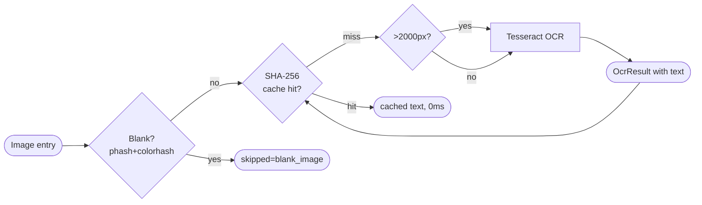
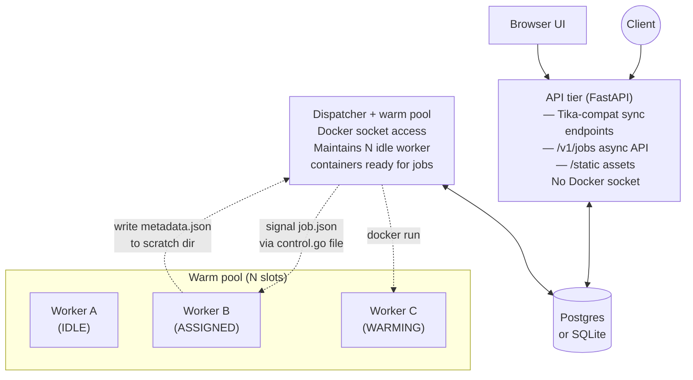
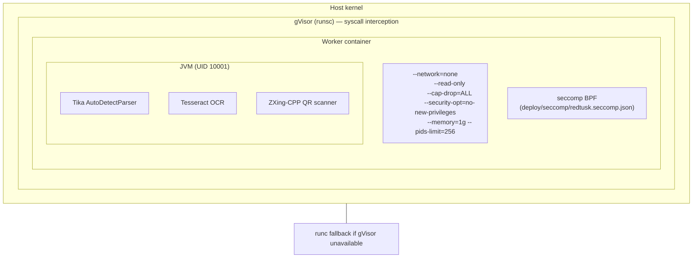
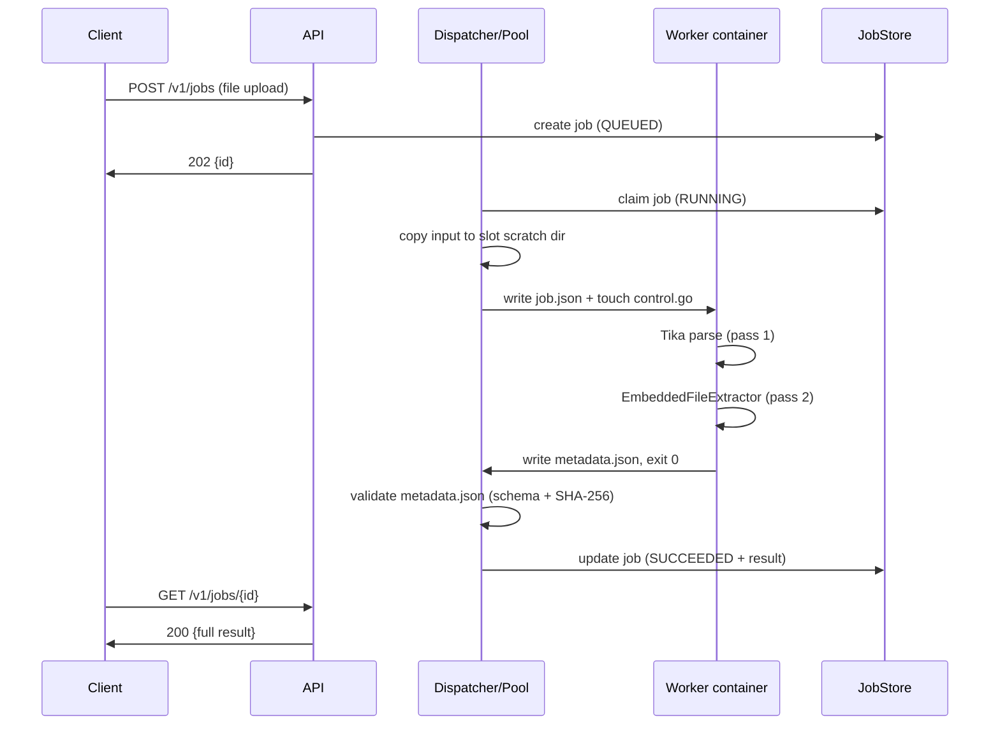

# RedTusk

<p align="center">
  
</p>

Sandboxed Apache Tika document extraction service.

🎶 [Theme song](https://suno.com/s/JfDeaLrS1JUN6dfe)

## The name

Apache Tika was named after **Jérôme Charron's son's stuffed animal** —
following the open-source naming tradition that Doug Cutting established with
Hadoop (named after his own child's toy stuffed elephant). When Jérôme and
Chris Mattmann were deciding what to call their proposed text analysis project,
"Tika" was the name of the stuffed toy, and it stuck. (*Tika in Action*,
Mattmann & Zitting, Manning 2011, p. 16.)

By pure coincidence, **Tika** is also the name of a gentle young Asian
elephant in *Barbie as The Island Princess* (2007) — the same year Tika was
proposed as an Apache Incubator project. In the film, Tika befriends Princess
Rosella after she is shipwrecked on a tropical island. She is sweet, loyal,
and innocent, cataloguing the world with open curiosity.

**RedTusk** leans into the coincidence with both hands. RedTusk wraps Apache
Tika to process adversarial documents — malicious RTF exploits, OLE payloads,
phishing lures, weaponized Office files. The Barbie story provides the arc:
when Rosella's identity is stolen and she is dragged into civilization
surrounded by deceit, Tika does not stay gentle. She follows her princess and
goes on a systematic miscreant-killing rampage. Her tusks, once ivory, come
back red.

The name is a stuffed-animal lineage joke, a Barbie movie tribute, and an
honest description of what happens to adversarial documents when they meet
this tool.

RedTusk takes an arbitrary document — Office, PDF, RTF, email, archive, image,
or any format Tika supports — and returns a rich JSON result: recursive
metadata, full extracted text, per-entry digests (SHA-256/MD5/SHA-1),
perceptual hashes (pHash + colorhash), JPEG thumbnails, QR codes, and OCR
text. Each extraction job runs in a freshly-spawned, hardened worker container
that is destroyed after the job completes. A warm pool of pre-spawned
containers (AppCDS + KSM) keeps JVM startup cost out of the critical path.

The intended use case is safely processing untrusted documents — including
adversarial samples and weaponized Office lures — from a web service or
analysis pipeline, with every job fully isolated.

RedTusk exposes a wire-compatible subset of `tika-server`'s HTTP API so
existing clients can repoint without code changes, plus a native async job API
and single-page UI.

---

## What it does

### Extraction pipeline

Each document goes through two passes inside the worker container:



**Parser configuration (always active):**

| Config | Setting | Reason |
|---|---|---|
| `PDFParserConfig.extractMarkedContent` | `true` | Semantic structure from tagged PDFs |
| `PDFParserConfig.extractUniqueInlineImagesOnly` | `false` | All image instances (duplicates are forensically significant) |
| `OfficeParserConfig.includeMissingRows` | `true` | Hidden rows in Excel lures |
| `OfficeParserConfig.extractMacros` | `true` (default) | VBA modules as embedded entries |
| `RFC822Parser.extractAllAlternatives` | `true` | Both plain-text and HTML bodies from email |

### OCR pipeline (when enabled)



---

## Architecture

### Three-process deployment (Compose)



**Split design:** The API tier and dispatcher run in the same Python process
by default (`redtusk serve`), but the API has no Docker socket — only the
dispatcher does. The worker containers have no database credentials and
never talk to the network.

### Worker container sandbox layers



**Layers outside → in:**

| Layer | What it does |
|---|---|
| **gVisor (runsc)** | Intercepts all syscalls; the JVM never talks to the host kernel directly. Auto-detected; falls back to runc. |
| **Container flags** | `--network=none` (no exfil), `--read-only` rootfs, `--cap-drop=ALL`, `no-new-privileges` |
| **seccomp BPF** | `deploy/seccomp/redtusk.seccomp.json` — allowlist of ~50 syscalls, applied on runc workers via `REDTUSK_WORKER_SECCOMP_PROFILE` |
| **AppArmor** | `deploy/apparmor/redtusk-worker` — `Pix` on scanner binaries, deny everything else (runc + AppArmor hosts) |
| **JVM UID 10001** | Non-root, minimal capability set |
| **One job per container** | Container is destroyed after job completes; no state leaks between jobs |
| **Dispatcher validation** | JSON Schema + SHA-256 recompute + size cap before trusting worker output |

### Job lifecycle



---

## Deployment profiles

| | Default | High-density |
|---|---|---|
| JVM | OpenJDK 25 (Temurin) — AppCDS cold start | Azul Zulu CRaC 25 — CRIU restore |
| Warm-start time | ~2.0 s | ~0.1 s |
| Per-slot RSS (idle, with KSM) | ~90 MB | ~50 MB |
| Pool RAM (10 slots) | ~900 MB | ~350 MB |
| Memory dedup | AppCDS + KSM | AppCDS + KSM + CRaC |
| Capabilities at steady state | none (`--cap-drop=ALL`) | none (dropped post-restore) |
| gVisor compatible | ✓ | ✗ (CRIU needs real kernel) |
| Targets | Fargate, EKS, runsc, runc, EC2 | Self-managed EC2 + runc only |

Set `REDTUSK_PROFILE={default,high-density}`.

---

## Quick start

### Compose (recommended)

```sh
# Build the worker image
docker build -f deploy/docker/Dockerfile.default -t redtusk-worker:default .

# Start the stack (auto-detects docker socket GID)
./deploy/docker/redtusk-compose up --build -d

# Web UI + API at http://localhost:8000/
```

The `redtusk-compose` wrapper auto-detects the host's Docker socket GID and
passes everything else straight through to `docker compose`.

### Production deployment (nginx + Let's Encrypt)

Clone the repo on the server, write a `.env` file, build the worker image, then start the stack:

```sh
git clone https://github.com/wmetcalf/RedTusk.git /home/coz/redtusk
cd /home/coz/redtusk

# Worker image (takes ~15–20 min — compiles Tika from the wmetcalf fork)
docker build -f deploy/docker/Dockerfile.default -t redtusk-worker:default .

# Production .env — adjust to taste
cat > deploy/docker/.env << 'EOF'
DOCKER_GID=$(stat -c %g /var/run/docker.sock)
REDTUSK_PORT=8002
POSTGRES_PASSWORD=<strong-random-password>
REDTUSK_WORKER_IMAGE=redtusk-worker:default
REDTUSK_PROFILE=default
REDTUSK_ENABLE_OCR=true
REDTUSK_POOL_SIZE=4
REDTUSK_JOB_TIMEOUT_S=120
REDTUSK_WORKER_WARMUP_TIMEOUT_S=180
EOF

# Start API + dispatcher + postgres
./deploy/docker/redtusk-compose up -d
```

**nginx reverse proxy** — create `/etc/nginx/sites-available/redtusk`:

```nginx
server {
    listen 80;
    listen [::]:80;
    server_name redtusk.example.com;

    location /.well-known/acme-challenge/ { root /var/www/html; }
    location / { return 301 https://$host$request_uri; }
}

server {
    listen 443 ssl;
    listen [::]:443 ssl;
    server_name redtusk.example.com;

    ssl_certificate     /etc/letsencrypt/live/redtusk.example.com/fullchain.pem;
    ssl_certificate_key /etc/letsencrypt/live/redtusk.example.com/privkey.pem;
    include /etc/letsencrypt/options-ssl-nginx.conf;
    ssl_dhparam /etc/letsencrypt/ssl-dhparams.pem;

    add_header X-Frame-Options "SAMEORIGIN" always;
    add_header X-Content-Type-Options "nosniff" always;
    add_header Strict-Transport-Security "max-age=31536000; includeSubDomains" always;

    client_max_body_size 500m;

    proxy_set_header Host $host;
    proxy_set_header X-Real-IP $remote_addr;
    proxy_set_header X-Forwarded-For $proxy_add_x_forwarded_for;
    proxy_set_header X-Forwarded-Proto $scheme;
    proxy_http_version 1.1;
    proxy_buffering off;
    proxy_request_buffering off;
    proxy_read_timeout 600s;
    proxy_send_timeout 600s;
    proxy_connect_timeout 30s;

    location = /v1/healthz {
        proxy_pass http://<backend-ip>:8002;
    }
    location / {
        proxy_pass http://<backend-ip>:8002/;
    }
}
```

```sh
sudo ln -sf /etc/nginx/sites-available/redtusk /etc/nginx/sites-enabled/redtusk
sudo nginx -t && sudo systemctl reload nginx

# Enroll Let's Encrypt certificate
sudo certbot --nginx -d redtusk.example.com --non-interactive --agree-tos -m you@example.com
```

### Local dev (no Docker required)

```sh
python3 -m venv .venv && .venv/bin/pip install -e .[dev]
.venv/bin/pytest tests/unit tests/http   # no Docker or JVM needed
.venv/bin/redtusk version
```

Python 3.12+ required.

---

## API reference

### Per-request query parameters

All job and sync endpoints accept these overrides:

| Parameter | Default | Description |
|---|---|---|
| `enable_qr` | `true` | QR/barcode scanning |
| `enable_ocr` | `false` | Tesseract OCR on image entries |
| `enable_thumbnails` | `true` | Generate JPEG thumbnails |
| `max_recursion_depth` | `10` | Max embedding depth (1–50) |
| `max_embedded_entries` | `5000` | Max entries extracted (1–10000) |

### Tika-compatible (synchronous)

Each request claims a warm pool slot (timeout: `REDTUSK_SYNC_QUEUE_TIMEOUT_S`,
default 30 s). Returns `503 + Retry-After` on pool exhaustion.

| Method | Path | Returns | Notes |
|---|---|---|---|
| `PUT` | `/tika` | `text/plain` | Root entry text |
| `PUT` | `/tika/form` | `text/plain` | Multipart form |
| `PUT` | `/rmeta` | `application/json` | Full recursive metadata |
| `PUT` | `/rmeta/text` | `application/json` | Text form |
| `PUT` | `/rmeta/html` | `application/json` | HTML form |
| `PUT` | `/rmeta/xml` | `application/json` | XML form |
| `PUT` | `/meta` | `application/json` | Root-entry metadata only |
| `PUT` | `/detect/stream` | `text/plain` | Content-type detection |
| `PUT` | `/unpack` | `application/x-tar` | Embedded resources as tarball |
| `PUT` | `/unpack/all` | `application/x-tar` | Embedded + root as tarball |
| `PUT` | `/language/stream` | `text/plain` | Language detection |
| `GET` | `/version` | `text/plain` | Server version |
| `GET` | `/mime-types` | `application/json` | Supported MIME list |
| `GET` | `/parsers` | `application/json` | Parser inventory |

### RedTusk-native (asynchronous)

| Method | Path | Returns | Notes |
|---|---|---|---|
| `POST` | `/v1/jobs` | `202 + {id}` | Submit job (multipart or raw body) |
| `GET` | `/v1/jobs/{id}` | JSON | Status + full result when complete |
| `GET` | `/v1/jobs/{id}/artifacts/{name}` | varies | Embedded files, thumbnails, text |
| `GET` | `/v1/jobs/{id}/infected-zip` | `application/zip` | Password-protected artifact zip |
| `GET` | `/v1/jobs` | JSON | Paginated job list (`limit`, `offset`, `q`) |
| `DELETE` | `/v1/jobs/{id}` | `204` | Safe-delete (terminal states only; 409 if active) |
| `GET` | `/v1/readyz` | `200 / 503` | Readiness probe |
| `GET` | `/metrics` | Prometheus text | Prometheus scrape endpoint |
| `GET` | `/` | `text/html` | Single-page UI |
| `GET` | `/static/*` | varies | Logo, favicon, static assets |

### Result schema (`ExtractResult`)

```json
{
  "redtusk_version": "0.1.0",
  "input": {
    "sha256": "...", "size_bytes": 140041,
    "filename_hint": "doc.docx", "submitted_at": "2026-05-11T..."
  },
  "extraction": {
    "root_content_type": "application/vnd.openxmlformats-officedocument...",
    "root_language": "en",
    "duration_ms": 4800,
    "entries": [
      {
        "path": "/",
        "depth": 0,
        "content_type": "application/vnd.openxmlformats...",
        "size_bytes": 140041,
        "sha256": "...", "md5": "...", "sha1": "...",
        "has_thumbnail": false,
        "phash": "f0e8...", "colorhash": "0f000000000000",
        "metadata": { "dc:title": "Q1 Report", ... },
        "text": "Full extracted text...",
        "language": "en",
        "qr": { "codes": [], "skipped": "no_images" },
        "ocr": { "text": "", "language": null, "duration_ms": 0, "skipped": "no_images" }
      },
      {
        "path": "/image-0.png",
        "content_type": "image/png",
        "has_thumbnail": true,
        "phash": "0000000000000000",
        "ocr": { "text": "", "skipped": "blank_image", "duration_ms": 0 }
      }
    ]
  },
  "limits": { "max_recursion_depth": 10, "max_embedded_entries": 5000, ... },
  "truncated": null,
  "warnings": [],
  "sandbox": { "profile": "default", "runtime": "runsc", "appcds": true, "ksm": true, "crac": false }
}
```

**`ocr.skipped` values:**

| Value | Meaning |
|---|---|
| `null` | OCR ran (text may or may not be present) |
| `disabled` | OCR disabled for this job |
| `no_images` | Entry is not an image type |
| `blank_image` | Skipped — phash/colorhash indicates blank/uniform image |
| `error` | OCR attempted but failed |
| `timeout_budget` | OCR budget exhausted |

---

## Configuration

All limits funnel through `redtusk.limits.Limits.from_env()`. Both the CLI
and HTTP API honor the same `REDTUSK_*` env vars.

### Extraction

| Variable | Default | Description |
|---|---|---|
| `REDTUSK_MAX_INPUT` | `104857600` | Max upload size (100 MiB) |
| `REDTUSK_MAX_EMBEDDED_ENTRIES` | `5000` | Recursion entry cap |
| `REDTUSK_MAX_RECURSION_DEPTH` | `10` | Recursion depth cap |
| `REDTUSK_MAX_EXTRACTED_BYTES` | `524288000` | Extracted text cap (500 MiB) |
| `REDTUSK_ENABLE_THUMBNAILS` | `1` | Generate JPEG thumbnails for image entries |

### OCR

| Variable | Default | Description |
|---|---|---|
| `REDTUSK_ENABLE_OCR` | `0` | OCR (opt-in globally; or per-request) |
| `REDTUSK_OCR_LANG` | `eng` | Tesseract `-l` language string |
| `REDTUSK_OCR_TIMEOUT_S` | `15` | Per-call Tesseract wall-clock limit |
| `REDTUSK_OCR_MAX_IMAGE_DIM` | `2000` | Downscale images to this px before OCR (`0`=disabled) |
| `REDTUSK_OCR_SKIP_BLANK` | `1` | Skip OCR on blank/uniform images (phash+colorhash) |

### Pool and jobs

| Variable | Default | Description |
|---|---|---|
| `REDTUSK_POOL_SIZE` | `10` | Steady-state warm slot count |
| `REDTUSK_POOL_BURST_SIZE` | `5` | Extra slots on sustained queue depth |
| `REDTUSK_POOL_BURST_TRIGGER_S` | `3` | Queue depth duration (s) before burst |
| `REDTUSK_POOL_BURST_DRAIN_S` | `60` | Idle time (s) before reaping burst slots |
| `REDTUSK_POOL_MAX_SIZE` | `32` | Hard pool ceiling |
| `REDTUSK_POOL_SPAWN_RATE_LIMIT` | `4.0` | Max container starts per second |
| `REDTUSK_JOB_TIMEOUT_S` | `60` | Per-job wall-clock limit; SIGKILL on expiry |
| `REDTUSK_SYNC_QUEUE_TIMEOUT_S` | `30` | Sync request blocks this long for a slot |
| `REDTUSK_JOB_RETENTION_SECONDS` | `86400` | Job record TTL (1 day) |

### Deployment

| Variable | Default | Description |
|---|---|---|
| `REDTUSK_PROFILE` | `default` | Worker profile: `default` or `high-density` |
| `REDTUSK_DATABASE_URL` | `sqlite:///./redtusk-jobs.db` | JobStore: sqlite or `postgresql://...` |
| `REDTUSK_WORKER_IMAGE` | `redtusk-worker:default` | Worker container image |
| `REDTUSK_WORKER_RUNTIME` | auto | `runsc` or `runc` (auto-selects runsc if installed) |
| `REDTUSK_WORKER_MEMORY_MB` | `1024` | Container `--memory` limit |
| `REDTUSK_WORKER_SECCOMP_PROFILE` | empty | runc-only seccomp profile path |
| `REDTUSK_WORKER_APPARMOR_PROFILE` | empty | runc-only AppArmor profile name |
| `REDTUSK_DISABLE_KSM` | `0` | Set `1` to skip `madvise(MADV_MERGEABLE)` |

Full reference: `src/redtusk/limits.py`.

---

## Memory deduplication

### AppCDS (both profiles)

Built into the worker image. The Dockerfile runs the worker in
`--appcds-warmup` mode against a small corpus, dumping `redtusk.jsa` via
`-XX:ArchiveClassesAtExit`. At runtime, `-XX:SharedArchiveFile=redtusk.jsa
-Xshare:on` maps the archive read-only; the host page cache shares those
pages across all containers, saving ~30–80 MB of class metadata per slot.

### KSM (both profiles, opt-in)

`KsmHelper.java` calls `madvise(MADV_MERGEABLE)` on JVM heap regions via JNI.
The host kernel deduplicates identical pages across containers. Enable on
self-managed Linux:

```sh
sudo install -m 755 deploy/ksm/enable-ksm.sh /usr/local/bin/redtusk-enable-ksm.sh
sudo systemctl enable --now redtusk-ksm
```

**Side-channel note:** KSM enables FLUSH+RELOAD timing observations across
merged pages. With `--network=none` and one-job-per-container the practical
threat is theoretical. Set `REDTUSK_DISABLE_KSM=1` for high-sensitivity
workloads.

### CRaC (high-density profile only)

`Dockerfile.high-density` bakes a CRIU checkpoint of the warm JVM into the
image. At container start, `criu restore` resumes from the checkpoint in
~0.1 s vs. ~2 s for a cold JVM. `CapDropper.java` drops
`CAP_CHECKPOINT_RESTORE` and `CAP_SETPCAP` before opening the job fifo;
steady-state capability set is identical to the default profile.

**CRaC is incompatible with gVisor** — CRIU requires direct `/proc`/kernel
access. Use `runc` only.

---

## Security

```
Worker isolation stack (outside → in)
══════════════════════════════════════
  gVisor (runsc)                 syscall-level interception
  ┌─ --network=none              no exfiltration path
  ├─ --read-only rootfs          no persistent writes
  ├─ --cap-drop=ALL              zero Linux capabilities
  ├─ --security-opt no-new-priv  no setuid escalation
  ├─ --memory=1g --pids=256      resource caps
  ├─ seccomp BPF allowlist       ~50 syscalls (runc only)
  ├─ AppArmor profile            Pix on scanners (runc only)
  └─ UID 10001, one job          no cross-job state
```

Additional measures:

- Input file deleted from shared volume immediately after worker reads it
- `metadata.json` validated by dispatcher (JSON Schema + SHA-256 + size cap) before being trusted
- All RTF files scanned by `RtfIocScanner` for template injection, UNC paths, protocol handlers, null-byte URLs, and OLE class obfuscation
- Tika configured with `MacroSecurityLevel=3`, no Java, no OLE updates, no remote resources
- HTTP security headers: CSP, `X-Frame-Options: DENY`, `X-Content-Type-Options: nosniff`, `Cache-Control: no-store`, `Referrer-Policy: no-referrer`

---

## Building

```sh
# Default worker image (AppCDS + KSM)
docker build -f deploy/docker/Dockerfile.default -t redtusk-worker:default .

# High-density worker image (+ CRaC; requires elevated build caps)
docker build \
  --security-opt seccomp=unconfined \
  --cap-add SYS_PTRACE --cap-add CHECKPOINT_RESTORE \
  -f deploy/docker/Dockerfile.high-density \
  -t redtusk-worker:high-density .

# API/dispatcher image (built automatically by compose)
docker build -f deploy/docker/Dockerfile.api -t redtusk-api:dev .
```

---

## Tests

```sh
# Pure unit + HTTP — no JVM, no Docker required
pytest tests/unit tests/http

# Java worker unit tests
cd worker_jvm && mvn test

# Docker image tests — needs built images + Docker daemon
pytest tests/docker -m docker

# Full pipeline — needs live stack + sandbox
pytest tests/integration -m integration
```

---

## Project layout

```
RedTusk/
├── src/redtusk/
│   ├── api.py               FastAPI: tika-compat + /v1/jobs + UI
│   ├── dispatcher.py        Job claim loop, drives the warm pool
│   ├── pool.py              Warm pool state machine (WARMING/IDLE/ASSIGNED/DRAINING)
│   ├── worker_runtime.py    Per-profile container spawn / signal / reap
│   ├── translation.py       rmeta → /tika, /meta, /detect, /unpack, /language
│   ├── limits.py            Limits.from_env() — all REDTUSK_* vars
│   ├── schema.py            JSON Schema validator for worker output
│   ├── jobs/                JobStore: memory, sql_store (sqlite + postgres), retention
│   ├── sandbox/             Container hardening flags + runtime detect
│   ├── static/              index.html, logo.webp/png, favicon.ico
│   └── observability/       structlog + prometheus_client
├── worker_jvm/
│   └── src/main/java/io/redtusk/worker/
│       ├── Main.java              warmup | checkpoint | run modes
│       ├── ParserRunner.java      Drives Tika RecursiveParserWrapper
│       ├── EmbeddedFileExtractor.java  Pass 2: save, hash, thumbnail
│       ├── RtfIocScanner.java     RTF threat-indicator extraction
│       ├── FifoLoop.java          Block on control.go, read job.json
│       ├── KsmHelper.java         JNI madvise(MADV_MERGEABLE)
│       └── CapDropper.java        JNI capability drop post-CRaC restore
├── deploy/
│   ├── docker/              Dockerfiles, docker-compose.yml, redtusk-compose
│   ├── apparmor/            redtusk-worker AppArmor profile
│   ├── seccomp/             BPF seccomp allowlist (x86_64 + ARM64)
│   └── ksm/                 enable-ksm.sh, systemd unit
├── tests/
│   ├── unit/                in-process, no Docker/JVM
│   ├── http/                FastAPI TestClient, mocked dispatcher
│   ├── integration/         full pipeline (marked: integration)
│   └── docker/              built-image tests (marked: docker)
└── docs/
    ├── specs/               Architecture and design specs
    └── plans/               Implementation plans
```
